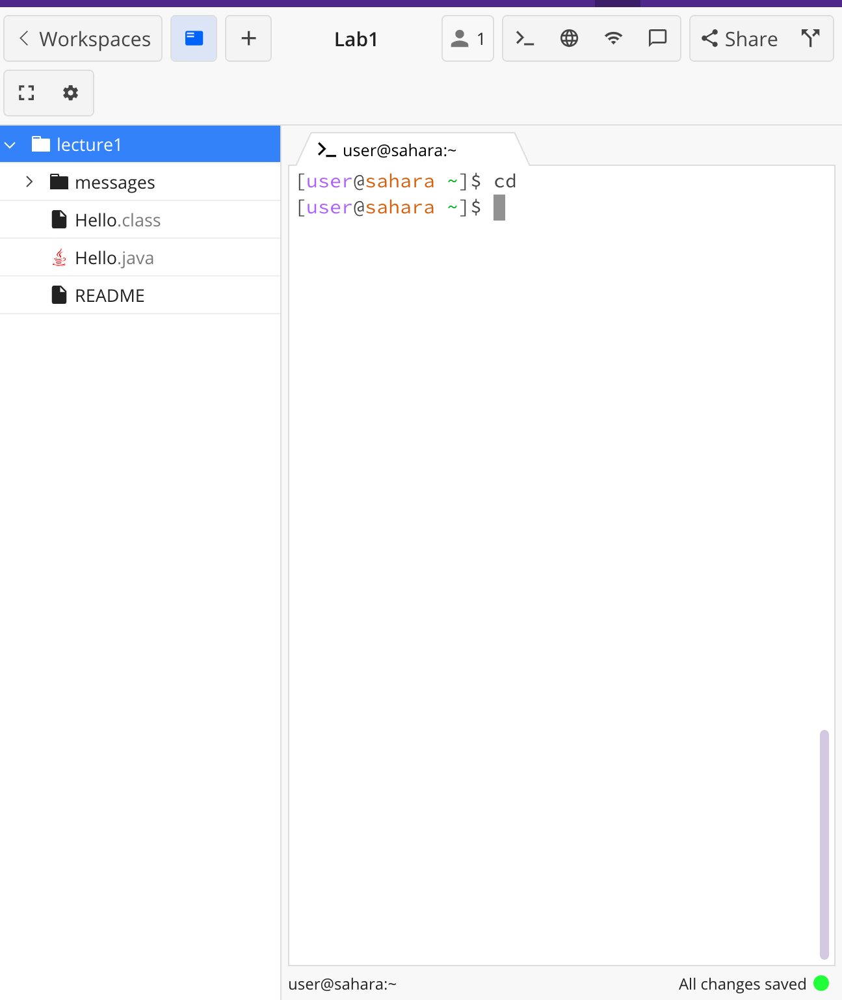
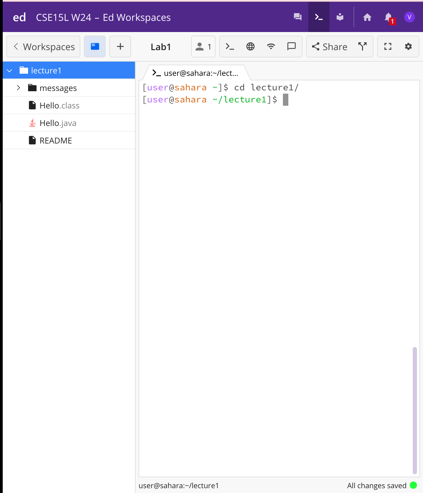
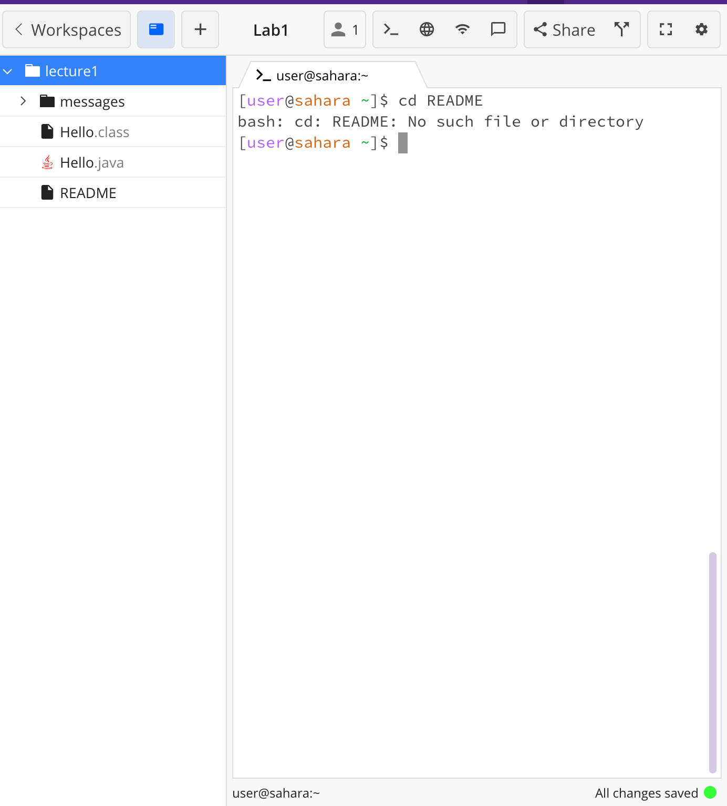

**cd No Argument**

The current directory was /home  
The output was nothing because using cd changes the directory. If the current directory was lecture1 for example, this would move it back to home.  
This output is not an error as nothing should happen if you are in the /home directory.  

**cd Path to Directory**

The current directory was /home  
The output was that the current directory became /lecture1 and the prompt was updated. This was because the argument is what the directory was changed to.  
This output is not an error as the current directory was successfully changed.  

**cd Path to File**

The current directory was /lecture  
The output was that it said not a directory. cd can only be used for directories, not files. 
This output is an error files can not be the argument for cd.  
