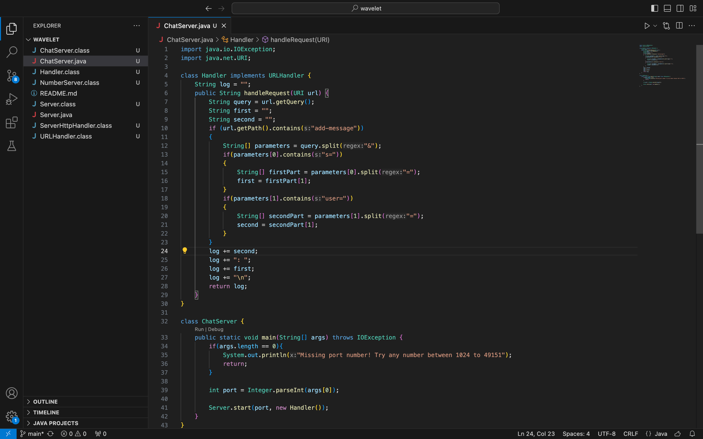
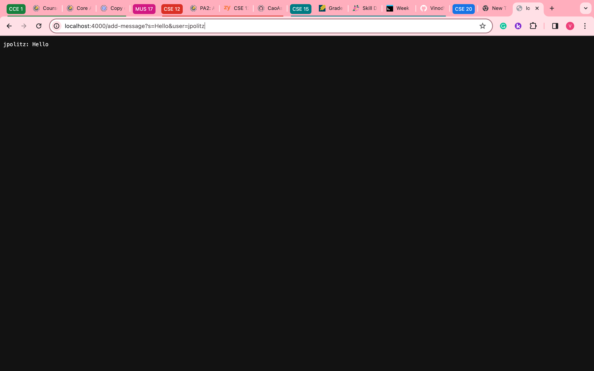
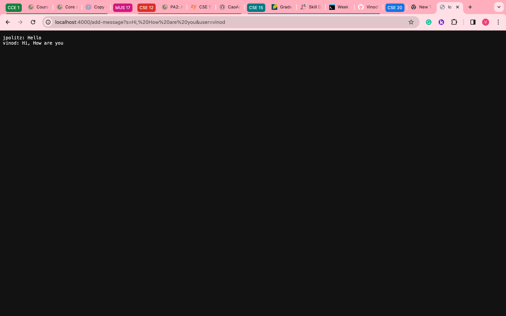
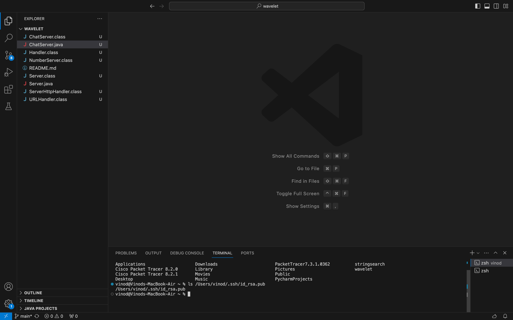
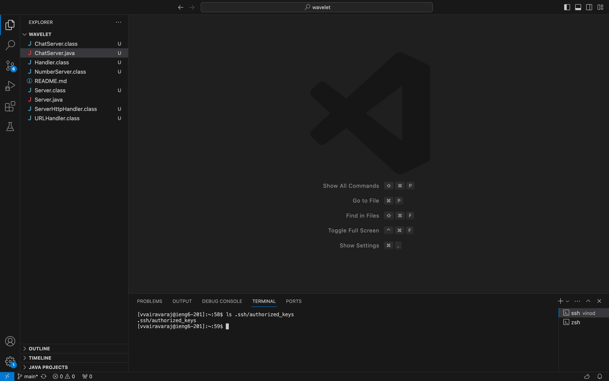
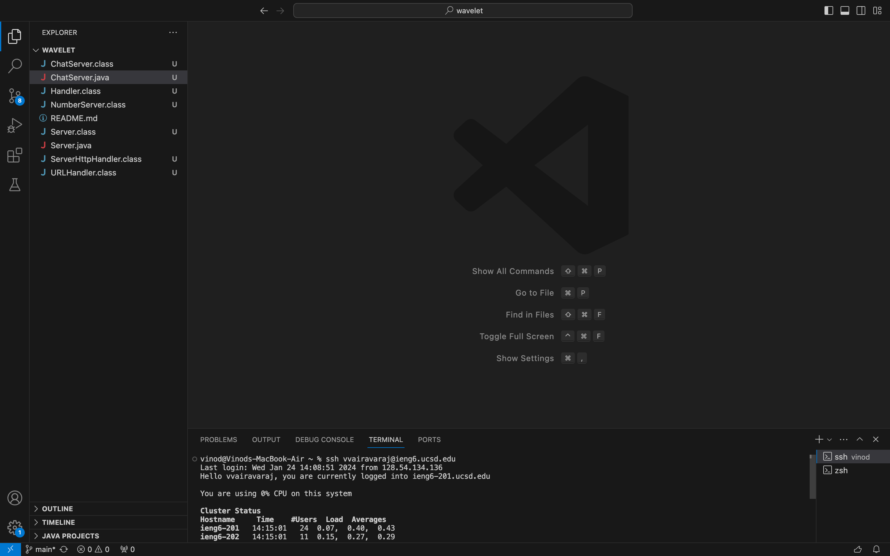

# Week 2 Lab Report
## ChatServer

Above is the code for this lab. <br/>

Above is a screenshot after one addition to the chat log. The handle request method is being called. <br/> \
The relevant argument is the url of the server. Pieces of this url such as the path and
query are used later in the method. Some relevant fields are ```query``` which contains
the query of the url and ```first```, ```second```, and ```log``` which contain empty 
strings that will be updated with parts of the final return value. <br/> \
The ```first``` and ```second``` fields are updated with the section of the query after
```s=``` and ```user=``` respectively. Also, ```log``` is updated with those two updated fields 
and is formatted. <br/>\
<br/>

Above is a screenshot after the second addtion to the chat log. The handle request method is being called again. <br/> \
The relevant argument is the url of the server. The path is checked to see if it is ```add-message``` and the parts before the 
= sign in the query are checked to see if they are ```s=``` and ```user=```. The relevant fields are ```query``` which contains
the query of the url and ```first```, ```second```, and ```log``` which contain empty 
strings that will be updated with parts of the final return value. <br/> \
```first``` is now overwritten to ```How are you``` while ```second``` is overwritten to ```vinod```. ```log``` is updated
to reflect this change while keeping the same formatting. <br/> \
## SSH

Above is a screenshot of the absolute path for the private key. <br/> \

Above is a screenshot of the absolute path for the public key. <br/> \

Above is a screenshot of my logging in without using the password. <br/> \


