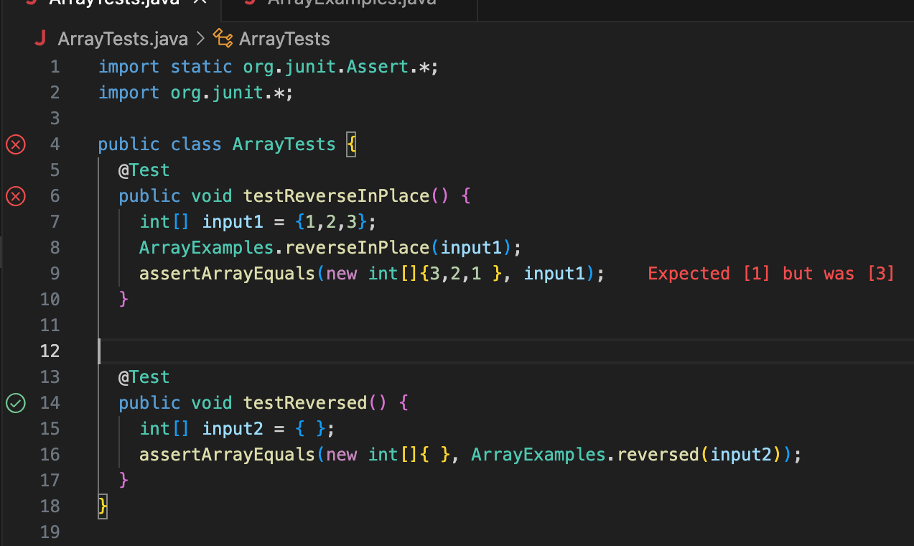

# Week 3 Lab Report
## Bugs
The ```reverseInPlace``` method <br>
Failure Inducing Input: 
```
    @Test 
	public void testReverseInPlace() {
    int[] input1 = {1,2,3};
    ArrayExamples.reverseInPlace(input1);
    assertArrayEquals(new int[]{3,2,1}, input1);
	}
```
<br>
Non-Failure Inducing Input: 

```
    @Test 
	public void testReversed() {
    int[] input1 = {};
    ArrayExamples.reverseInPlace(input1);
    assertArrayEquals(new int[]{}, ArrayExamples.reversed(input1));
	}
 ```

<br>
Symptom:  <br>
Bug: <br>
Before - <br>

```
static void reverseInPlace(int[] arr) { 
    for(int i = 0; i < arr.length; i += 1) { 
      arr[i] = arr[arr.length - i - 1]; 
    }
  }
```

After - <br>
```
static void reverseInPlace(int[] arr) {
    for(int i = 0; i < arr.length/2; i += 1) {
      int tp = arr[i];
      arr[i] = arr[arr.length - i - 1];
      arr[arr.length - i - 1] = tp;
    }
  }
```
The fix addresses the issue as now the array is correctly reversed. Before the fix, the two halves would be mirrors of each other 
as the updated values would be used for the second half. Changing the range of the for loop to half of the length, makes the loop stop after
the elements are swapped. <br>

## Researching Commands
Grep <br>
 ```- v ``` option <br>
Example 1 <br>
```
grep -v "rna" output_file.txt > notRna.txt
```
```
wc notRna.txt 
  481834 3846209 43218779 notRna.txt
```
The command is returning lines without "rna" in it. This is then added to an output file. Has use in excluding certain keywords. <br>
Example 2 <br>
```
grep -v "I" base-pair.txt > removeI.txt
```
```
wc removeI.txt 
       3      48     412 removeI.txt
```
The command is returning lines without "I" in it. This is then added to an output file. Has use in excluding certain keywords. <br>
Source: [GeeksforGeeks] (https://www.geeksforgeeks.org/grep-command-in-unixlinux/) <br>

 ```- c ``` option <br>
Example 1 <br>
```
grep -c "I" base-pair.txt > countI.txt
```
```
wc countI.txt 
       1       1       2 countI.txt
```
The command prints only a count of the lines with "I". This is then added to an output file. Has use in identifying how common something is in a file. <br>
Example 2 <br>
```
grep -r -c "rna" technical/biomed > countI.txt
```
```
wc countI.txt                                 
     837     837   31542 countI.txt
```
The command is printing lines with "rna" in it. This is then added to an output file. Has use in identifying how common something is in a file. <br>
Source: [GeeksforGeeks] (https://www.geeksforgeeks.org/grep-command-in-unixlinux/)

```- i ``` option <br>
Example 1 <br>
```
grep -r -i "RnA" technical/biomed > rnaBiomed.txt
```
```
wc rnaBiomed.txt 
    9023   83583  884025 rnaBiomed.txt
```
The command returns lines with the given string (rNa) irrespective of case. This is then added to an output file. Has use in identifying words that may or may not be capitalized. <br>
Example 2 <br>
```
grep -i "tHe" biomedFull.txt > noTheBiomed.txt
```
```
wc noTheBiomed.txt 
  586900 5605596 66490173 noTheBiomed.txt
```
The command returns lines with the given string (tHe) irrespective of case. This is then added to an output file. Has use in identifying words that may or may not be capitalized. <br>
Source: [GeeksforGeeks] (https://www.geeksforgeeks.org/grep-command-in-unixlinux/)

```- o ``` option <br>
Example 1 <br>
```
grep -o "rna" biomedFull.txt > onlyRNABiomed.txt
```
```
wc onlyRNABiomed.txt                            
   16888   16888   67552 onlyRNABiomed.txt
```
The command only returns occurrences of the given text (rna). This is then added to an output file. This can be used to find the number of occurrences of a string in a file. <br>
Example 2 <br>
```
grep -o "the" base-pair.txt > onlyThe.txt
```
```
wc onlyThe.txt 
       8       8      32 onlyThe.txt
```
The command only returns occurrences of the given text (the). This is then added to an output file. This can be used to find the number of occurrences of a string in a file. <br>
Source: [GeeksforGeeks] (https://www.geeksforgeeks.org/grep-command-in-unixlinux/)
