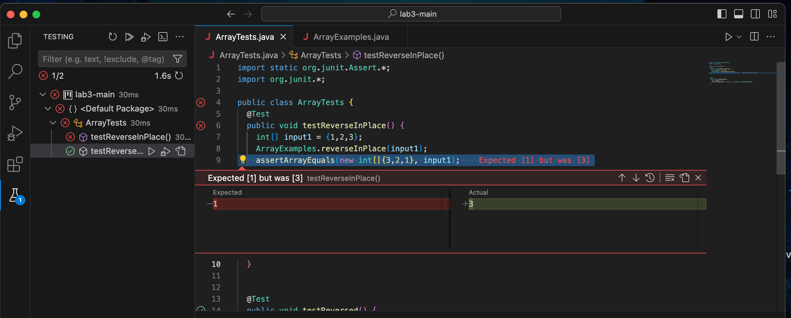

# Week 4 Lab Report
## Bugs
The ```reverseInPlace``` method <br>
Failure Inducing Input: 
```
    @Test 
	public void testReverseInPlace() {
    int[] input1 = {1,2,3};
    ArrayExamples.reverseInPlace(input1);
    assertArrayEquals(new int[]{3,2,1}, input1);
	}
```
<br>
Non-Failure Inducing Input: 

```
    @Test 
	public void testReversed() {
    int[] input1 = {};
    ArrayExamples.reverseInPlace(input1);
    assertArrayEquals(new int[]{}, ArrayExamples.reversed(input1));
	}
 ```
Symptom: 

