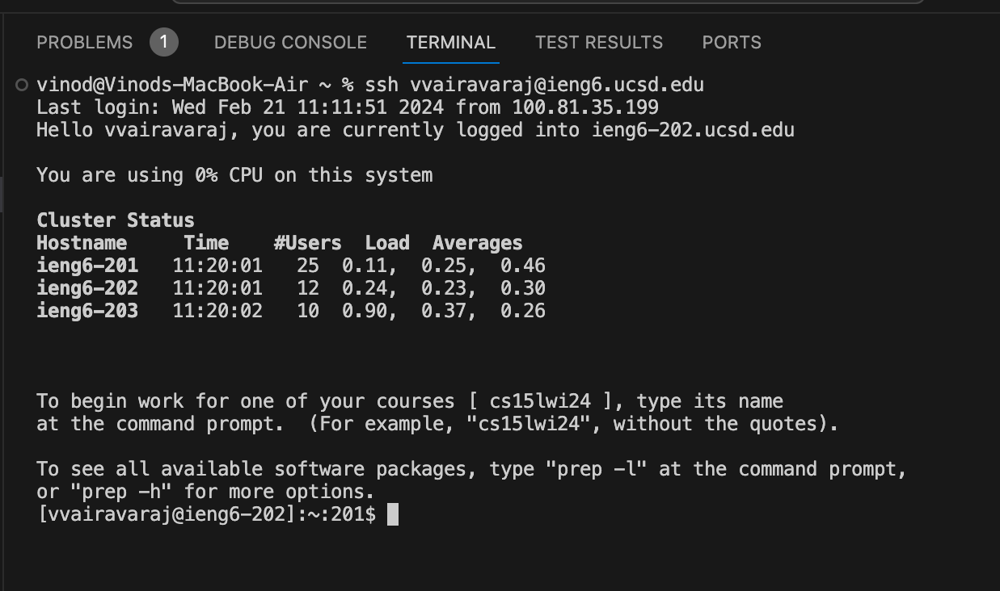
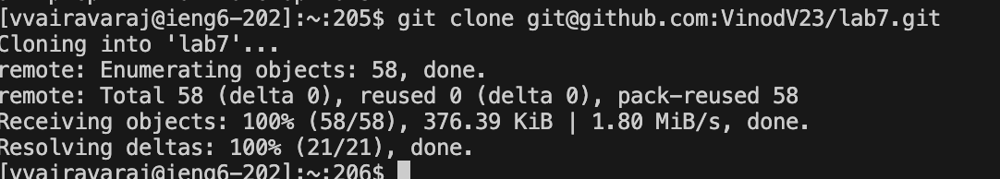
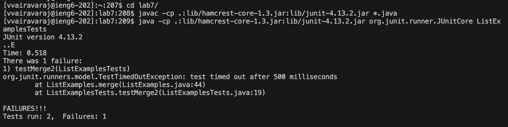
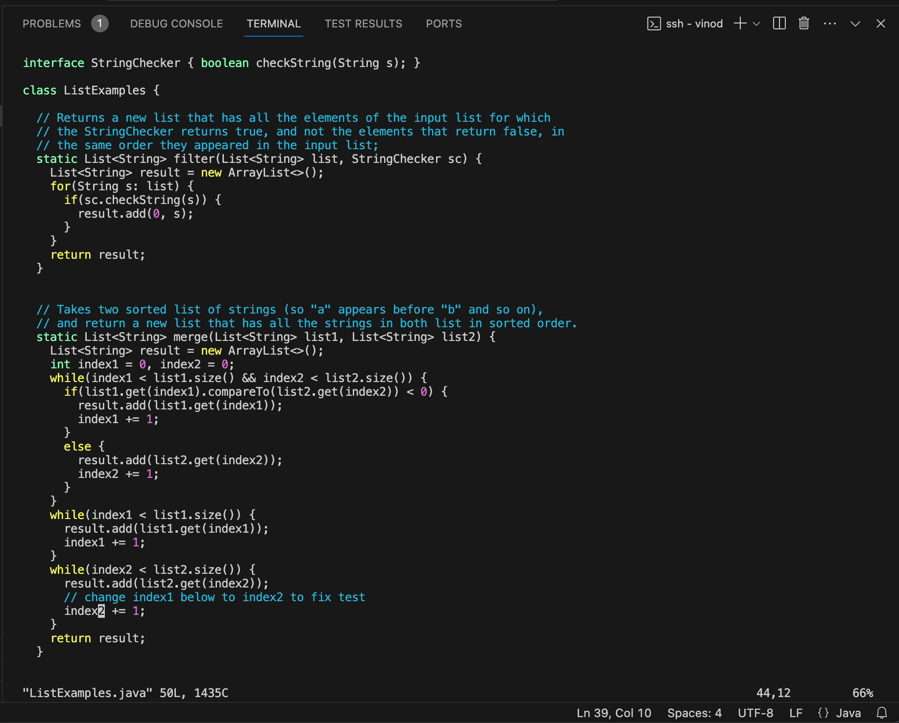
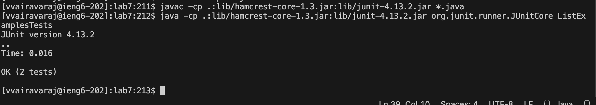

# Week 4 Lab Report
## Step 4

Keys Pressed: ```<Ctrl + R>```, s, ```<Enter>``` Opening up the command history, I entered on the ```ssh vvairavaraj@ieng6.ucsd.edu``` command. This command logged me into ieng6.
## Step 5

Keys Pressed: ```<Ctrl + R>```, g, i, t, ```<Space>```, c, l, ```<Enter>```. Opening up the command history, I entered the ```git clone git@github.com:VinodV23/lab7.git``` command. I had to type more of the first part of the command because other git commands are used in this process. This command cloned through ssh from the fork I made.
## Step 6

Keys Pressed: c, d, ```<Space>```, l, ```<Tab>```, ```<Enter>```. ```<Ctrl + R>```, j, a, v, a, c, ```<Enter>```. ```<Ctrl + R>```, j, a, v, a, ```<Space>```, c, ```<Enter>```. I first moved directories to ```lab7/```. Then I used the command history to use this command ```javac -cp .:lib/hamcrest-core-1.3.jar:lib/junit-4.13.2.jar *.java``` to compile all java files. Then I used the command history to execute the test file ```java -cp .:lib/hamcrest-core-1.3.jar:lib/junit-4.13.2.jar org.junit.runner.JUnitCore ListExamplesTests```
## Step 7

Keys Pressed: v, i, m, ```<Space>```, L, ```<Tab>```, ., ```<Tab>```, ```<Eneter>```. G, k, k, k ,k ,k ,k, w, w, h, h, x, i, 2, ```<Esc>```, :, w, q. I used ```vim ListExamples.java``` to open the file in vim. Then I navigated to where the typo was and changed it to 2. I then used ```:wq``` to save and quit the file. 
## Step 8

Keys Pressed: ```<Ctrl + R>```, j, a, v, a, c, ```<Enter>```. ```<Ctrl + R>```, j, a, v, a, ```<Space>```, c, ```<Enter>```. I reopened the command history and compiled all the java files again ```javac -cp .:lib/hamcrest-core-1.3.jar:lib/junit-4.13.2.jar *.java```. Then I execute the test file ```java -cp .:lib/hamcrest-core-1.3.jar:lib/junit-4.13.2.jar org.junit.runner.JUnitCore ListExamplesTests```.
