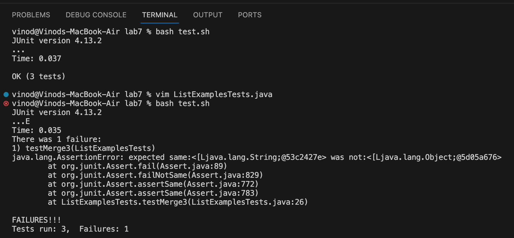
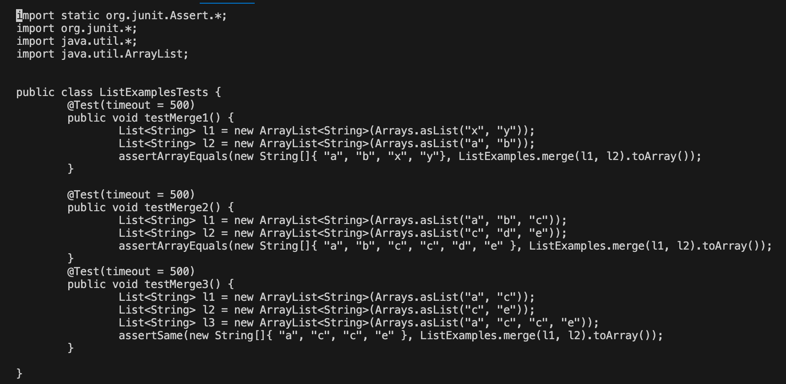
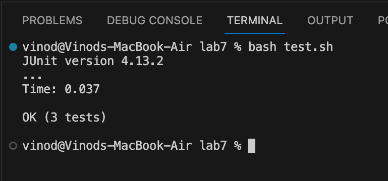
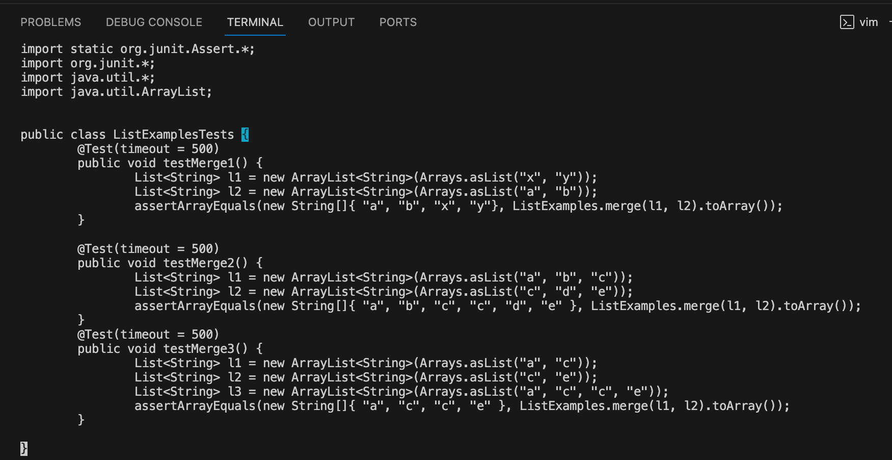

# Week 5 Lab Report
## Part 1
Step 1 (Student Post):  


I am testing my ```ListExamples.java``` file using Junit. One of my tests is failing even though my ```merge``` method looks good. I am guessing that the error has something to do with my Junit test and that it might be the setup or  ```assert``` in the test. \
Step 2 (TA Response): 
Take a look at the ```assert``` you are using. Are you trying to see if the expected array and merged array are the same?
Step 3 (Fix):


Using the TA comments, I changed the ```assertSame``` to ```assertArrayEquals```. The error was that ```assertSame``` checks to see if both objects point to the same reference, not if the contents are equal. ```assertArrayEquals``` does check to see if the contents of the arrays are equal.
Step 4 (All Information):
File and Directory: ```lab7``` is the directory. ```ListExamplesTests.java``` is the Junit file. ```ListExamples.java``` is the file holding the ```merge``` method. ```test.sh``` is the bash file that is used to compile and execute the tests.
